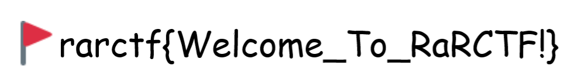

# Coherence Check

### Description - So we're up to date, we've moved away from using s*nity check. Here's your flag.


Initially, this challenge may seem super simple, type out the flag you get in the image below.



Sure, this will work and give you the flag of `rarctf{Welcome_To_RaRCTF!}`, however, in design of an interesting Coherence Check, I decided to go Down The Rabbit Hole, and add an extra easter egg never seen before in the land of Capture the Flag Coherence Checks - Steganography.

I decided to skip the 3 common pillars of CTF Steganography - Binwalk, Steghide and Strings. The next thing that I thought of was metadata, so I decided to create some.

For those with access to a command line, `exiftool` is great for metadata related problems. (can just be installed with `sudo apt install exiftool` for those with the apt package manager.)

Simply running `exiftool [filename]` will bring us something interesting, as shown below.
```
➜  ~ exiftool coherence.png
[note, I have trimmed the output of this to make it look nice on you, the reader. If you're brave enough to try the full command, good luck.]
ExifTool Version Number         : 12.16
File Name                       : coherence.png
Directory                       : .
File Size                       : 32 KiB
File Modification Date/Time     : 2021:08:06 14:45:33+01:00
File Access Date/Time           : 2021:08:07 18:47:57+01:00
File Inode Change Date/Time     : 2021:08:07 18:47:57+01:00
File Permissions                : rw-r--r--
File Type                       : PNG
File Type Extension             : png
MIME Type                       : image/png
Image Width                     : 1000
Image Height                    : 145
Bit Depth                       : 8
Color Type                      : RGB
Compression                     : Deflate/Inflate
Filter                          : Adaptive
Interlace                       : Noninterlaced
Exif Byte Order                 : Little-endian (Intel, II)
Bits Per Sample                 : 8 8 8
Orientation                     : Horizontal (normal)
X Resolution                    : 37.78947368
Y Resolution                    : 37.78947368
Resolution Unit                 : cm
Software                        : GIMP 2.10.22
Color Space                     : sRGB
Image Supplier                  :
Image Creator                   :
Copyright Owner                 :
Licensor                        :
Description                     : if you see this, DM jammy#0402 on discord secret_stego for a special role!
```
Most of this is irrelevant, but the author (me!) left a note in the description of the metadata, stating ` if you see this, DM jammy#0402 on discord secret_stego for a special role!` If you DMd jammy#0402, you would have received the Rabbithole Enthusiast role on the RaRCTF discord. Congrats to the below people for actually finding this:

- yardenohana#0558

#### Flag: rarctf{Welcome_To_RaRCTF!}
