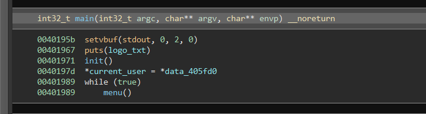
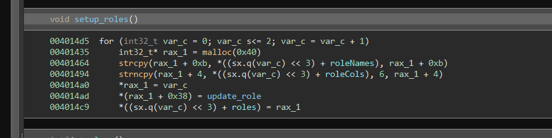
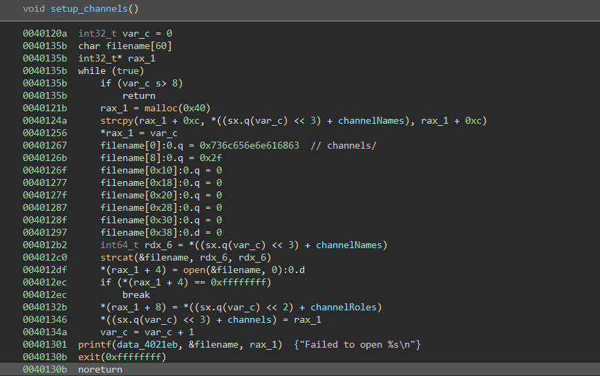
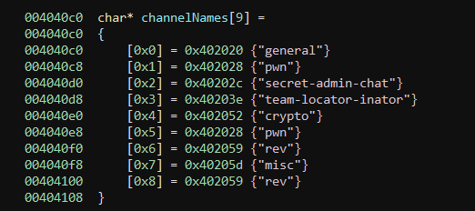
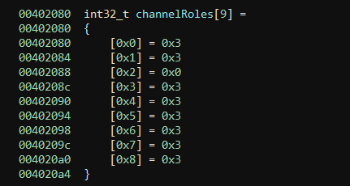
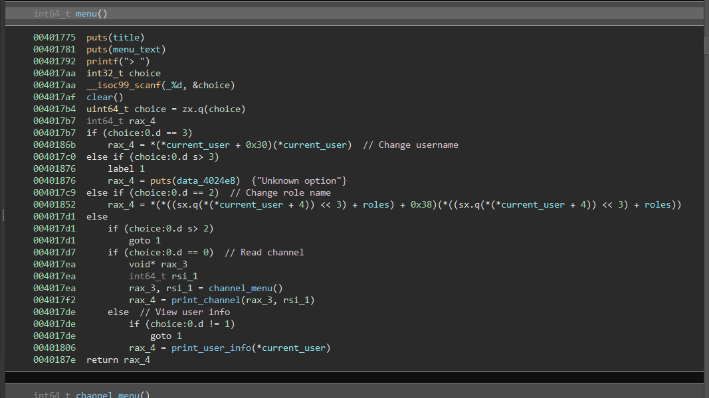
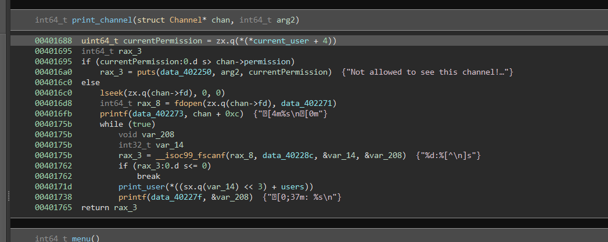
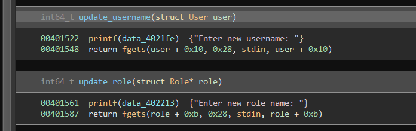
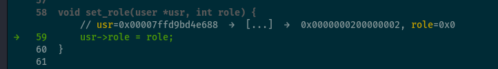
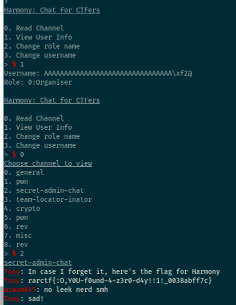

## RaRmony

Category: Pwn


### Reversing

The binary is provided unstripped.  Beginning at `main`, we can see that the `current_user` global is set to a data region in the binary. Given that it is a pointer, we can assume that `current_user` is a struct of some kind, which will be confirmed later. It first calls `init`, then goes into an infinite loop of `menu()`.



`init` in turn calls `setup_roles()`, `setup_channels()`, `setup_users()` in turn.



`roles` appears to be an array of 3 pointers to `role` objects, which are allocated with a size of 0x40. We can also see the offsets of the `roleName`and `roleColour` properties.  A pointer to the `update_role` function is also placed at offset 0x38. We can use this to construct a simple struct definition to assist us.

```c
struct Role
{
    char unknown[4];
    char col[7];
    char name[40];
    void (* update_role)(struct Role*);
};
```



The `setup_channels` function is similar, `malloc`ing 8 `Channel` structs on the heap. It also save's the file descriptors of `channel/<names>`, where `<names>` is 



There is also a `channelRoles` array of integers:



Based on the 0 lining up with `secret-admin-chat` we can assume  that this specifies a privilege level required to read a channel, where lower numbers are higher privileged. There are a number of users pre-set, each with a corresponding role - these in turn correspond to the roles `Organiser`, `Bot`, `Participant`, and an unset field. `setup_roles` simply constructs the roles in memory, in the `roles` array pointer.




The menu reads our choice in and performs an action accordingly. Changing the username results in a function pointer being called that resides at an offset from `current_user` itself, with a parameter of the `current_user` address. Because of this, we can see that the binary is implementing a very primitive kind of OOP. Turning this into C-like pseudocode:

````c
switch (option) {
    case 0:
        print_channel(channel_menu());
        break;
    case 1:
        print_user_info(current_user);
        break;
    case 2:
        roles[*current_user + 4][0x38](roles[*current_user + 4]);
        break;
    case 3:
        current_user[0x30](current_user);
        break;
    default:
        puts("Unknown option");
}
````

We can use this info to define a primitive struct to help with further reversing

```c
struct User
{
    char unknown[4];
    int32_t role;
    void (* update_role)(void*);
    char unknown2[32];
    void (* update_username)(void*);
};
```

`roles` is an array of pointers to `Role` objects, indexed by the current user's `role` attribute.

`channel_menu()` lists the available channels, and allows the user to choose one. It returns a pointer to the chosen `Channel`.



`print_channel` first checks we have permission to access the channel. If so, it then prints out the messages in the 'channel' file, with some formatting.

At this point, it should be clear that the goal is to raise our privilege (from an initial level of 3) to 0 in order to read the admin channel.

### The Bug

The bug is a buffer overflow in reading user input. However, it won't become clear until an understanding of the structs in use.



Both functions read 40 bytes into the name field of their respective objects. While the `Role` struct has a large enough buffer for this, the `User` struct has a 32 byte buffer. This gives us an 8 byte overflow into the next field - helpfully, it is a function pointer. Normally, this points to the `update_username` function, which we can use freely. Using this, we can call our own function of choice. Given that our goal is to elevate our role, we will call the `set_role` function (normally only used during setup to assign roles to users). This takes a User pointer and a role integer.



Luckily, `rsi` happens to be set to 0 when we reach this point, so the role is given freely. From here, we can simply read the forbidden channel:



`rarctf{:O,Y0U-f0und-4-z3r0-d4y!!1!_0038abff7c}`